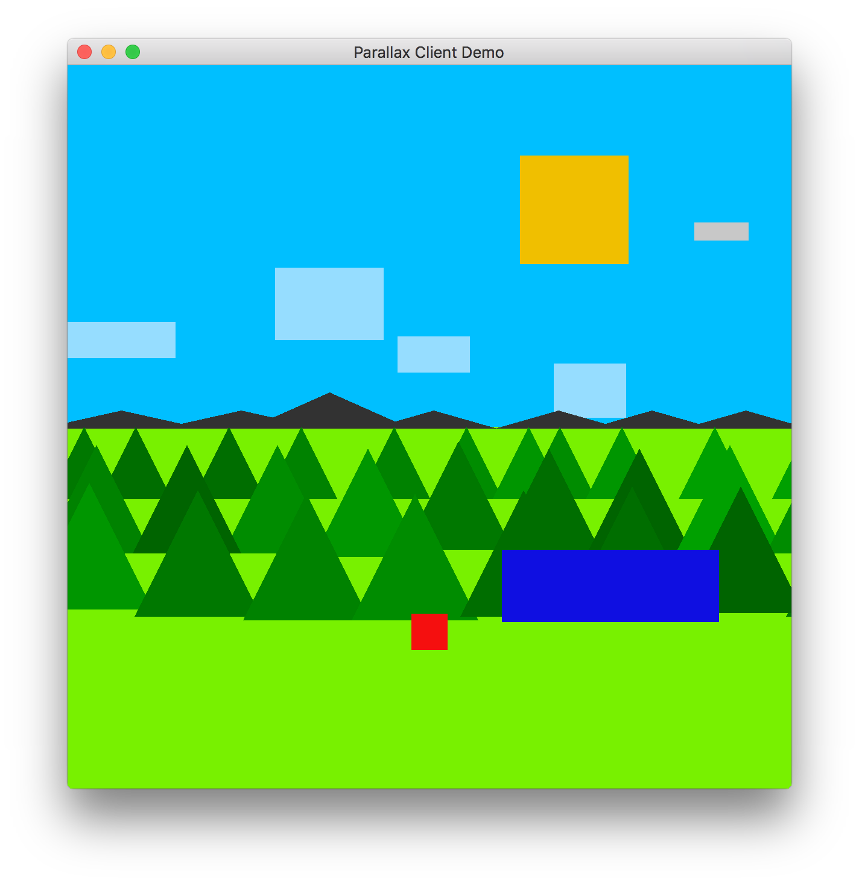

Parallax Client
===============

This is intended to be a client for a game,
initial graphics will be a proof of concept
of a parallax scene.

Dependencies
------------

* Cargo: https://crates.io/
```
$ cargo --version
cargo 0.13.0 (109cb7c 2016-08-19)
```


* Rust: https://www.rust-lang.org/en-US/
```
 $ rustc --version
rustc 1.12.0
```


Hopefully both of these are available on your operating system.
* OSX: Brew
* Linux distribution: yum/dnf/pacman/etc
* Windows: Download from the install page on https://www.rust-lang.org/en-US/
* Any: rustup, see https://www.rustup.rs/
 * the `| sh` makes me sad, please do be wary of piping into shell

Usage
-----

```
cd programs/plotting/
cargo run assets/sin.csv
```


Example Scene
-------------



